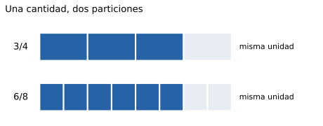

## Propósito y alcance

Una fracción puede expresar parte de una unidad, una medida, una razón, un cociente o un operador. Se conectan estos significados sin confundir el número racional con una sola escritura. Se explican equivalencia, simplificación y operaciones, con especial atención a la unidad de referencia y al orden. La construcción formal mediante clases de equivalencia se reserva para Sistemas numéricos.

## Fracciones y significados

:::: {.knowledge-object #tag-00EH tag="00EH" type="definicion" title="Número racional y representación fraccionaria" requiere="00DZ"}
::: {#def-00EH .theorem-style-definition data-environment-tag="00EH"}
## Número racional y representación fraccionaria

Un **número racional** es un número que admite una escritura $a/b$ con $a,b\in\mathbb Z$ y $b\ne0$. El conjunto de estos números se denota $\mathbb Q$. En una fracción, $a$ es el **numerador** y $b$ el **denominador**. Para comparar y normalizar fracciones se puede elegir $b>0$.
:::

Una fracción es una representación, no una pareja de números que se opera siempre por separado. Distintas fracciones pueden representar el mismo número. Los enteros son racionales porque $a=a/1$. El denominador nunca es cero.

::: {#exm-00EH .theorem-style-remark data-environment-tag="00EI"}
## Número racional y representación fraccionaria

$3/4$, $6/8$ y $-9/(-12)$ representan el mismo racional. Además, $-5=-5/1$ y $0=0/7$, pero $3/0$ no define un racional.
:::
::::

:::: {.knowledge-object #tag-00EJ tag="00EJ" type="observacion" title="Parte-todo, medida, cociente, razón y operador" requiere="00EH,00CH"}
::: {#concept-00EJ .editorial-text}
## Parte-todo, medida, cociente, razón y operador

La escritura $a/b$, con denominador positivo, admite varios significados:

(a) **Parte-todo:** $a$ partes de tamaño $1/b$ de una unidad subdividida en partes iguales.
(b) **Medida:** iteración de la unidad fraccionaria $1/b$ sobre una recta o una magnitud.
(c) **Cociente:** resultado de dividir $a$ por $b$.
(d) **Razón:** comparación multiplicativa entre dos cantidades.
(e) **Operador:** transformación $x\mapsto(a/b)x$.
:::

El modelo parte-todo con una sola figura explica directamente fracciones entre 0 y 1, pero debe ampliarse a varias unidades para fracciones mayores que 1. Partes iguales significa igualdad de la magnitud considerada: para área no basta igualdad de forma o de número de piezas. En razones, el referente puede ser parte-parte y no parte-total.

::: {#exm-00EJ .theorem-style-remark data-environment-tag="00EK"}
## Parte-todo, medida, cociente, razón y operador

$3/4$ puede ser tres cuartos de una cinta, la posición $0{,}75$ en una recta, el reparto de $3$ litros entre $4$ personas o el operador que transforma $20$ en $15$.
:::
::::

:::: {.knowledge-object #tag-00EL tag="00EL" type="tecnica" title="Unidad fraccionaria y fracciones mayores que uno" requiere="00EJ,00DL"}
::: {#concept-00EL .editorial-text}
## Unidad fraccionaria y fracciones mayores que uno

Para representar $a/b\ge0$ con $b>0$, se fija una unidad, se divide en $b$ partes de igual medida y se iteran $a$ partes. Si $a=qb+r$, con $0\le r<b$, entonces $a/b=q+r/b$.
:::

La unidad debe permanecer estable entre representaciones. Un denominador mayor produce partes menores cuando se mantiene la misma unidad; esto no permite ordenar fracciones con numeradores arbitrarios. La escritura mixta es una suma, no una multiplicación implícita.

::: {#exm-00EL .theorem-style-remark data-environment-tag="00EM"}
## Unidad fraccionaria y fracciones mayores que uno

$11/4=2+3/4$. En la recta se sitúa entre 2 y 3, a tres cuartos de unidad de 2. Dibujar únicamente tres de cuatro partes de una figura perdería las dos unidades completas.
:::
::::

## Equivalencia, simplificación y denominadores comunes

{fig-alt="Dos tiras iguales: tres de cuatro partes y seis de ocho partes están coloreadas y ocupan la misma longitud."}

:::: {.knowledge-object #tag-00EN tag="00EN" type="propiedad" title="Equivalencia de fracciones" requiere="00EH,00E9"}
::: {#prp-00EN .theorem-style-plain data-environment-tag="00EN"}
## Equivalencia de fracciones

Para $b,d\ne0$:

(a) $a/b=c/d$ si y solo si $ad=bc$.
(b) Para un entero $k\ne0$, $a/b=(ka)/(kb)$.
(c) Cambiar el signo de numerador y denominador simultáneamente conserva el valor.
:::

Amplificar o simplificar modifica la partición, no la cantidad. Solo se cancelan factores comunes; no se cancelan términos de una suma como si fueran factores. La igualdad de productos cruzados permite verificar equivalencia, pero no debe convertirse en una receta desvinculada de la unidad.

::: {#exm-00EN .theorem-style-remark data-environment-tag="00EO"}
## Equivalencia de fracciones

$6/8=3/4$ porque $6\cdot4=8\cdot3$. En cambio, $(2+3)/(2+5)=5/7$, y cancelar los 2 produciría incorrectamente $3/5$.
:::
::::

:::: {.knowledge-object #tag-00EP tag="00EP" type="definicion" title="Fracción irreducible y simplificación mediante MCD" requiere="00EN,00DV"}
::: {#def-00EP .theorem-style-definition data-environment-tag="00EP"}
## Fracción irreducible y simplificación mediante MCD

Una fracción $a/b$ con $b>0$ es **irreducible** si $\operatorname{MCD}(|a|,b)=1$. Para $a\ne0$, dividir numerador y denominador por $g=\operatorname{MCD}(|a|,b)$ produce su representante irreducible. Para $a=0$, se adopta $0/1$.
:::

Se utiliza el MCD sobre valores positivos como se definió en naturales; el caso cero se trata aparte. Una fracción irreducible no es necesariamente propia: $7/3$ es irreducible y mayor que 1.

::: {#exm-00EP .theorem-style-remark data-environment-tag="00EQ"}
## Fracción irreducible y simplificación mediante mcd

$-18/24=-3/4$, al dividir ambos términos por $6$. Los valores $3$ y $4$ son coprimos. La representación irreducible de $0/24$ es $0/1$.
:::
::::

:::: {.knowledge-object #tag-00ER tag="00ER" type="tecnica" title="Denominadores comunes y MCM" requiere="00EN,00DX"}
::: {#concept-00ER .editorial-text}
## Denominadores comunes y MCM

Para fracciones con denominadores positivos $b,d$, cualquier múltiplo común positivo $L$ permite escribir
$$\frac ab=\frac{a(L/b)}L,\qquad \frac cd=\frac{c(L/d)}L.$$
Elegir $L=\operatorname{MCM}(b,d)$ evita un denominador común innecesariamente grande.
:::

El denominador común convierte las cantidades en unidades fraccionarias del mismo tamaño. Es una herramienta para suma, resta y comparación; no es requisito para multiplicar fracciones.

::: {#exm-00ER .theorem-style-remark data-environment-tag="00ES"}
## Denominadores comunes y mcm

Para $5/12$ y $7/18$, $L=36$: se obtienen $15/36$ y $14/36$. Por tanto, $5/12>7/18$ y su diferencia es $1/36$.
:::
::::

## Orden y operaciones

:::: {.knowledge-object #tag-00ET tag="00ET" type="propiedad" title="Comparación y orden de racionales" requiere="00ER,00E1"}
::: {#prp-00ET .theorem-style-plain data-environment-tag="00ET"}
## Comparación y orden de racionales

Con $b,d>0$:

(a) $a/b<c/d$ si y solo si $ad<bc$.
(b) A igual denominador, se comparan los numeradores.
(c) Para numerador positivo fijo, aumentar el denominador disminuye la fracción.
(d) Entre negativos, el de mayor valor absoluto es menor.
:::

Antes de comparar se normaliza el signo de los denominadores. También pueden utilizarse referencias como 0, $1/2$ y 1. El tamaño de los numerales no determina el tamaño del racional.

::: {#exm-00ET .theorem-style-remark data-environment-tag="00EU"}
## Comparación y orden de racionales

$7/12>1/2$ porque $7>6$, mientras que $5/12<1/2$. Además, $-3/4<-2/3$ porque $-9/12<-8/12$.
:::
::::

:::: {.knowledge-object #tag-00EV tag="00EV" type="propiedad" title="Adición y sustracción de fracciones" requiere="00ER"}
::: {#prp-00EV .theorem-style-plain data-environment-tag="00EV"}
## Adición y sustracción de fracciones

Para $b,d\ne0$:
$$\frac ab+\frac cd=\frac{ad+bc}{bd},\qquad \frac ab-\frac cd=\frac{ad-bc}{bd}.$$
Si ambos denominadores son iguales a $b$, el resultado es $(a\pm c)/b$.
:::

Se suman o restan cantidades expresadas en una misma unidad fraccionaria. Sumar denominadores crea una unidad distinta sin justificación. En contextos de medida también debe conservarse la misma unidad física.

::: {#exm-00EV .theorem-style-remark data-environment-tag="00EW"}
## Adición y sustracción de fracciones

$2/3+1/4=8/12+3/12=11/12$. No es $(2+1)/(3+4)=3/7$: esa fracción incluso es menor que uno de los sumandos positivos.
:::
::::

:::: {.knowledge-object #tag-00EX tag="00EX" type="propiedad" title="Producto de racionales" requiere="00EJ,00EN"}
::: {#prp-00EX .theorem-style-plain data-environment-tag="00EX"}
## Producto de racionales

Para $b,d\ne0$,
$$\frac ab\cdot\frac cd=\frac{ac}{bd}.$$
El producto conserva la regla de signos de los enteros. Todo racional puede multiplicarse por otro racional y el resultado permanece en $\mathbb Q$.
:::

El operador «una fracción de una cantidad» explica por qué multiplicar por un racional entre 0 y 1 reduce una cantidad positiva. Multiplicar no siempre agranda. En un modelo de área, las dos particiones justifican el producto de denominadores.

::: {#exm-00EX .theorem-style-remark data-environment-tag="00EY"}
## Producto de racionales

$3/4$ de $2/3$ de una cinta es $(3/4)(2/3)=1/2$ de la cinta original. Además, $(5/6)(9/10)=3/4$ tras simplificar factores.
:::
::::

:::: {.knowledge-object #tag-00EZ tag="00EZ" type="definicion" title="Recíproco y división de racionales" requiere="00EX,00EB"}
::: {#def-00EZ .theorem-style-definition data-environment-tag="00EZ"}
## Recíproco y división de racionales

Para un racional no nulo $r=a/b$, su **recíproco** es $1/r=b/a$. La división por un racional no nulo se define mediante su recíproco:
$$\frac ab\div\frac cd=\frac ab\cdot\frac dc,$$
con $b,d,c\ne0$.
:::

El cociente responde cuántas veces una cantidad cabe en otra, o cuál es un factor de escala. Dividir por un número entre 0 y 1 puede aumentar el resultado positivo. «Invertir y multiplicar» se justifica porque el divisor por su recíproco vale 1; no se invierte el dividendo.

::: {#exm-00EZ .theorem-style-remark data-environment-tag="00F0"}
## Recíproco y división de racionales

$(3/4)\div(1/8)=6$: en tres cuartos de litro caben seis porciones de un octavo de litro. En cambio, dividir por $0/5$ no está permitido.
:::
::::

## Decimales y relación con la factorización prima

:::: {.knowledge-object #tag-00F1 tag="00F1" type="propiedad" title="Decimales finitos y periódicos" requiere="00DL,00EH"}
::: {#prp-00F1 .theorem-style-plain data-environment-tag="00F1"}
## Decimales finitos y periódicos

Todo racional admite una expansión decimal finita o eventualmente periódica. Recíprocamente, toda expansión decimal finita o eventualmente periódica representa un racional. En una división, la periodicidad surge de la repetición de restos.
:::

El denominador fija un número finito de posibles restos; si la división no termina, alguno se repite y se repite la secuencia de cifras. El período puede comenzar después de una parte no periódica. La barra identifica la parte que se repite; una calculadora suele mostrar una aproximación finita.

::: {#exm-00F1 .theorem-style-remark data-environment-tag="00F2"}
## Decimales finitos y periódicos

$3/8=0{,}375$, $2/3=0{,}\overline6$ y $1/6=0{,}1\overline6$. Para $x=0{,}\overline{27}$, se tiene $100x-x=27$, de donde $x=27/99=3/11$.
:::
::::

:::: {.knowledge-object #tag-00F3 tag="00F3" type="teorema" title="Criterio para una expansión decimal finita" requiere="00EP,00DT,00F1"}
::: {#thm-00F3 .theorem-style-plain data-environment-tag="00F3"}
## Criterio para una expansión decimal finita

Una fracción irreducible $a/b$ con $b>0$ admite expansión decimal finita si y solo si
$$b=2^m5^n,$$
con $m,n\in\mathbb N$. El caso $b=1$ está incluido.
:::

Una escritura finita equivale a un denominador que divide alguna potencia de 10; por el teorema fundamental de la aritmética, sus primos solo pueden ser 2 y 5. Es esencial simplificar antes de examinar el denominador.

::: {#exm-00F3 .theorem-style-remark data-environment-tag="00F4"}
## Criterio para una expansión decimal finita

$7/40$ termina porque $40=2^3\cdot5$. Aunque $6/15$ tiene denominador múltiplo de 3, primero se reduce a $2/5=0{,}4$. En cambio, $1/12$ no termina porque el 3 permanece en su denominador irreducible.
:::
::::

:::: {.knowledge-object #tag-00F5 tag="00F5" type="tecnica" title="Valor posicional y cálculo con decimales" requiere="00D9,00EX,00EZ"}
::: {#concept-00F5 .editorial-text}
## Valor posicional y cálculo con decimales

En un decimal finito, las posiciones a la derecha de la coma corresponden a décimos, centésimos, milésimos, etc. Para sumar se alinean posiciones del mismo valor; para multiplicar se interpreta cada factor como una fracción de denominador potencia de 10.
:::

Añadir ceros a la derecha de la parte decimal no cambia el valor. Para dividir puede multiplicarse dividendo y divisor por la misma potencia de 10; se conserva el cociente. Mover solo una coma cambia el problema.

::: {#exm-00F5 .theorem-style-remark data-environment-tag="00F6"}
## Valor posicional y cálculo con decimales

$0{,}4=0{,}40>0{,}35$. Además, $0{,}12\cdot0{,}3=(12/100)(3/10)=36/1\,000=0{,}036$, y $1{,}2/0{,}03=120/3=40$.
:::
::::

## Densidad y representaciones

:::: {.knowledge-object #tag-00F7 tag="00F7" type="propiedad" title="Densidad de los racionales" requiere="00EV,00ET"}
::: {#prp-00F7 .theorem-style-plain data-environment-tag="00F7"}
## Densidad de los racionales

Si $a,b\in\mathbb Q$ y $a<b$, entonces su promedio $(a+b)/2$ es racional y satisface
$$a<\frac{a+b}{2}<b.$$
En consecuencia, entre dos racionales distintos hay infinitos racionales; ningún racional tiene un siguiente racional inmediato.
:::

La propiedad contrasta con los enteros, donde cada número tiene un sucesor. Una recta marcada solo con algunas fracciones no muestra todos los racionales. La densidad no significa que todo punto de la recta sea racional.

::: {#exm-00F7 .theorem-style-remark data-environment-tag="00F8"}
## Densidad de los racionales

Entre $1/3$ y $1/2$ se encuentra $5/12$. Repitiendo el procedimiento entre $1/3$ y $5/12$ se obtiene $3/8$, y puede continuarse sin alcanzar un siguiente racional.
:::
::::

## Errores frecuentes y decisiones docentes

| Error o afirmación | Qué revisar | Representación o contraste |
|---|---|---|
| $1/8>1/6$ porque $8>6$ | Relación entre partición y tamaño | Dividir dos unidades iguales |
| Sumar numeradores y denominadores | Conservación de la unidad fraccionaria | Recta o tiras con denominador común |
| Multiplicar siempre agranda | Interpretación como operador | Calcular la mitad de una cantidad |
| $0{,}35>0{,}4$ porque $35>4$ | Valor posicional decimal | Comparar $35/100$ con $40/100$ |
| Una fracción siempre es menor que 1 | Uso restringido del modelo parte-todo | Iterar unidades sobre la recta |

Una representación continua debe fijar la unidad; una discreta debe precisar el conjunto de referencia. No se deduce un error conceptual de un único cálculo sin pedir justificación.

## Conexiones y procedencia

Desarrolla el capítulo 29 de la [tabla maestra](../../../docs/tabla-contenidos-maestra.md). Se conecta con [Naturales](numeros-naturales.qmd), [Reales](numeros-reales.qmd), [Razones y proporcionalidad](razones-proporcionalidad.qmd) y [Porcentajes](porcentajes.qmd). Redacción y ejemplos originales; [Fuentes consultadas](../../../docs/referencias-numeros-medicion.md).
