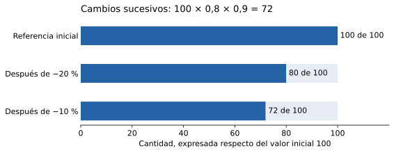

## Propósito y alcance

Los porcentajes expresan comparaciones con una referencia de cien unidades. Permiten interpretar participaciones, descuentos y variaciones, pero su significado depende del total o base de comparación. El capítulo conecta interpretaciones, cálculos y lectura crítica de porcentajes, manteniendo explícitas las condiciones de cada operación.

## Motivación y definición

Comparar 18 respuestas correctas de 20 con 21 de 30 exige tener en cuenta ambos totales. Expresar las razones respecto de cien facilita la comparación. En precios, encuestas y resultados educativos, la pregunta inicial es siempre: ¿porcentaje de qué cantidad?

:::: {.knowledge-object #tag-008P tag="008P" type="definicion" title="Porcentaje" pertenece_a="0000" requiere="00FV"}
::: {#def-008P .theorem-style-definition data-environment-tag="008P"}
## Porcentaje

Un **porcentaje** expresa una razón respecto de cien. Para un número real $p$,
$$p\,\%=\frac{p}{100}.$$
El símbolo porcentual forma parte de la expresión del número: $p\,\%$ y $p$ no representan el mismo valor.
:::

Como participación de una parte en un total positivo suele tomar valores entre 0 y 100 %. Como comparación o variación puede superar 100 % o ser negativo. Hay que declarar el referente y el significado; no se impone el intervalo de una participación a todas las aplicaciones.

::: {#exm-008P .theorem-style-remark data-environment-tag="00GH"}
## Porcentaje

$25\,\%=25/100=1/4=0{,}25$. Una cantidad que equivale al $150\,\%$ de otra vale $1{,}5$ veces esa referencia.
:::
::::

:::: {.knowledge-object #tag-00GI tag="00GI" type="tecnica" title="Porcentaje como fracción y decimal" requiere="008P,00F1"}
::: {#concept-00GI .editorial-text}
## Porcentaje como fracción y decimal

Para pasar de un porcentaje a una fracción o decimal se divide el número porcentual por 100. Para expresar un número $r$ como porcentaje se escribe $(100r)\,\%$.
:::

La conversión modifica la escritura, no el número. Una cuadrícula de cien celdas ilustra porcentajes enteros entre 0 y 100; una recta o un operador permite ampliarlos a valores decimales y mayores que cien.

::: {#exm-00GI .theorem-style-remark data-environment-tag="00GJ"}
## Porcentaje como fracción y decimal

$12{,}5\,\%=0{,}125=1/8$, mientras que $0{,}7=70\,\%$. El número $0{,}7\,\%$ es $0{,}007$, por lo que no equivale a $70\,\%$.
:::
::::

:::: {.knowledge-object #tag-008Q tag="008Q" type="tecnica" title="Calcular un porcentaje de una cantidad" pertenece_a="0000" requiere="008P"}
::: {#concept-008Q .editorial-text}
## Calcular un porcentaje de una cantidad

Para calcular el $p\,\%$ de una cantidad $x$, se aplica el operador multiplicativo
$$y=x\cdot\frac{p}{100}.$$
La cantidad $y$ conserva la unidad de $x$.
:::

También puede calcularse el 1 % dividiendo por 100, y multiplicar después por $p$. La descomposición usa la distributividad: 15 % puede calcularse como 10 % más 5 %. En una participación, el total debe estar definido y las partes deben ser comparables.

::: {#exm-008Q .theorem-style-remark data-environment-tag="008R"}
## Calcular un porcentaje de una cantidad

El $20\,\%$ de $350$ es $350\cdot20/100=70$. El $15\,\%$ de $200$ es $20+10=30$.
:::
::::

## Determinación de la parte, el total y el porcentaje

:::: {.knowledge-object #tag-00GK tag="00GK" type="propiedad" title="Recuperar el total y calcular una participación" requiere="008Q,00EZ"}
::: {#prp-00GK .theorem-style-plain data-environment-tag="00GK"}
## Recuperar el total y calcular una participación

Si $y=xp/100$:

(a) Para $p\ne0$, el total es $x=100y/p$.
(b) Para $x\ne0$, el número porcentual es $p=100y/x$.
(c) Si $p=0$, conocer $y=0$ no permite recuperar un total único.
:::

Las fórmulas provienen de una misma relación. No se divide por el porcentaje escrito como si el número 20 fuera 0,20. Para una participación usual se requiere total positivo y una parte comprendida entre cero y el total.

::: {#exm-00GK .theorem-style-remark data-environment-tag="00GL"}
## Recuperar el total y calcular una participación

Si $60$ es el $15\,\%$ de un total, ese total es $60/0{,}15=400$. Si $18$ de $24$ respuestas son correctas, la participación es $100(18/24)=75\,\%$.
:::
::::

## Aumentos, descuentos y recuperación del valor inicial

:::: {.knowledge-object #tag-00GM tag="00GM" type="propiedad" title="Factores de aumento y descuento" requiere="008Q"}
::: {#prp-00GM .theorem-style-plain data-environment-tag="00GM"}
## Factores de aumento y descuento

Para un valor inicial $x>0$:

(a) Un aumento de $p\,\%$, con $p\ge0$, produce $y=x(1+p/100)$.
(b) Un descuento de $d\,\%$, con $0\le d\le100$, produce $y=x(1-d/100)$.

La cantidad modificada es distinta de la cantidad que se añade o se descuenta.
:::

El 100 % representa la cantidad inicial. El factor reúne en una operación la base y su variación. Un descuento superior al 100 % no describe un precio final no negativo en este modelo.

::: {#exm-00GM .theorem-style-remark data-environment-tag="00GN"}
## Factores de aumento y descuento

Un precio hipotético de $\$40\,000$ con descuento de $25\,\%$ pierde $\$10\,000$ y queda en $\$30\,000$. Con aumento de $25\,\%$, queda en $\$50\,000$.
:::
::::

:::: {.knowledge-object #tag-00GO tag="00GO" type="tecnica" title="Valor inicial a partir del valor final" requiere="00GM"}
::: {#concept-00GO .editorial-text}
## Valor inicial a partir del valor final

Si $y=xF$ y $F\ne0$, se recupera $x=y/F$. Para aumentos se usa $F=1+p/100$; para descuentos menores que 100 % se usa $F=1-d/100$.
:::

El porcentaje inverso se calcula sobre una base diferente. Para deshacer un aumento no se descuenta el mismo porcentaje. Con descuento total, el precio final cero no identifica el precio inicial.

::: {#exm-00GO .theorem-style-remark data-environment-tag="00GP"}
## Valor inicial a partir del valor final

Si un precio quedó en $\$36\,000$ tras un descuento de $20\,\%$, el original era $36\,000/0{,}8=\$45\,000$. Aumentar el final en 20 % produciría $\$43\,200$, que no recupera el original.
:::
::::

## Variación absoluta, relativa y puntos porcentuales

:::: {.knowledge-object #tag-00GQ tag="00GQ" type="definicion" title="Variación absoluta y relativa" requiere="00GM"}
::: {#def-00GQ .theorem-style-definition data-environment-tag="00GQ"}
## Variación absoluta y relativa

Para valores inicial y final $x_0,x_1$:

(a) La **variación absoluta** es $\Delta x=x_1-x_0$.
(b) Si $x_0\ne0$, la **variación relativa respecto del valor inicial** es $r=(x_1-x_0)/x_0$.
(c) El cambio porcentual es $(100r)\,\%$.
:::

Para magnitudes usuales se interpreta con una base inicial positiva. Cuando la base es negativa, la fórmula puede producir un signo que no coincide con el lenguaje cotidiano de crecimiento y exige interpretación adicional. Si la base es cero, el cambio porcentual no está definido.

::: {#exm-00GQ .theorem-style-remark data-environment-tag="00GR"}
## Variación absoluta y relativa

Pasar de $80$ a $100$ aumenta $20$ unidades y $25\,\%$. Volver de $100$ a $80$ disminuye $20$ unidades y $20\,\%$, porque cambia la base.
:::
::::

:::: {.knowledge-object #tag-00GS tag="00GS" type="definicion" title="Puntos porcentuales" requiere="00GQ"}
::: {#def-00GS .theorem-style-definition data-environment-tag="00GS"}
## Puntos porcentuales

Si una proporción pasa de $p\,\%$ a $q\,\%$, su cambio es de $q-p$ **puntos porcentuales**. Si $p\ne0$, su cambio porcentual relativo respecto de la proporción inicial es $100(q-p)/p\,\%$.
:::

Puntos porcentuales expresan una diferencia entre números porcentuales; cambio relativo expresa una razón respecto del inicial. Se requieren poblaciones y criterios comparables para interpretar el cambio de una tasa o proporción.

::: {#exm-00GS .theorem-style-remark data-environment-tag="00GT"}
## Puntos porcentuales

Pasar de $40\,\%$ a $50\,\%$ aumenta $10$ puntos porcentuales, y representa un aumento relativo de $25\,\%$. No es un aumento relativo de 10 %.
:::
::::

## Porcentajes sucesivos y referencias distintas

{fig-alt="Tres barras representan 100 inicial, 80 después de un descuento de veinte por ciento, y 72 después de otro descuento de diez por ciento sobre 80."}

:::: {.knowledge-object #tag-00GU tag="00GU" type="propiedad" title="Composición de porcentajes sucesivos" requiere="00GM,00EX"}
::: {#prp-00GU .theorem-style-plain data-environment-tag="00GU"}
## Composición de porcentajes sucesivos

Si cada cambio se aplica al resultado del anterior, con factores $F_1,\ldots,F_n$, entonces
$$x_n=x_0F_1\cdots F_n.$$
Para $x_0\ne0$, el cambio relativo total es $F_1\cdots F_n-1$.
:::

No se suman los porcentajes sucesivos como si todos tuvieran la misma base. En un modelo puramente multiplicativo el orden de los factores no altera el final; costos fijos, redondeos intermedios o restricciones pueden romper esa equivalencia.

::: {#exm-00GU .theorem-style-remark data-environment-tag="00GV"}
## Composición de porcentajes sucesivos

Un descuento de 20 % seguido de otro de 10 % deja $0{,}8\cdot0{,}9=0{,}72$ del original: el descuento total es 28 %. Un aumento de 20 % seguido de una disminución de 20 % deja $1{,}2\cdot0{,}8=0{,}96$, una disminución neta de 4 %.
:::
::::

:::: {.knowledge-object #tag-00GW tag="00GW" type="observacion" title="Suma de porcentajes y base común" requiere="00GK"}
::: {#concept-00GW .editorial-text}
## Suma de porcentajes y base común

Sumar porcentajes describe una suma de partes solo cuando sus referentes son comunes y las partes pueden sumarse sin doble conteo. Si los totales son distintos, la participación conjunta se calcula sumando cantidades y luego dividiendo por el total conjunto.
:::

El promedio simple de porcentajes de grupos distintos solo coincide con la proporción global si sus tamaños son iguales, o bajo coincidencias particulares. Si los grupos se superponen, primero se elimina el doble conteo.

::: {#exm-00GW .theorem-style-remark data-environment-tag="00GX"}
## Suma de porcentajes y base común

En un grupo de 10 personas aprueban 8 (80 %); en otro de 30 aprueban 15 (50 %). En conjunto aprueban $23/40=57{,}5\,\%$, no el promedio simple de 65 %.
:::
::::

## Aplicaciones y lectura crítica

:::: {.knowledge-object #tag-00GY tag="00GY" type="aplicacion" title="Índices, composición y comparación de ofertas" requiere="00GQ,00FX"}
::: {#concept-00GY .editorial-text}
## Índices, composición y comparación de ofertas

En un índice de base 100, un nivel $I$ expresa $I/100$ veces la referencia. Los porcentajes de componentes describen una distribución si todos utilizan el mismo total y se controlan solapamientos. Las ofertas deben compararse mediante precio final por cantidad equivalente.
:::

Los ejemplos económicos son hipotéticos: una tasa elegida para ilustrar un cálculo no describe una obligación tributaria o un indicador vigente. Una rebaja, un porcentaje gratuito y una promoción por unidades requieren modelos distintos.

::: {#exm-00GY .theorem-style-remark data-environment-tag="00GZ"}
## Índices, composición y comparación de ofertas

Un índice pasa de 100 a 125 y luego a 120: el primer cambio es 25 %, pero el segundo es $(120-125)/125=-4\,\%$. En una oferta «lleve 3 y pague 2», con unidades de igual precio, la reducción del costo por unidad es $1/3$, aproximadamente $33{,}3\,\%$.
:::
::::

## Errores frecuentes y síntesis para la consulta docente

| Pregunta | Relación | Control |
|---|---|---|
| ¿Cuánto es $p\,\%$ de $x$? | $y=xp/100$ | Identificar la base |
| ¿Cuál era el total? | $x=100y/p$ | $p\ne0$ |
| ¿Qué porcentaje representa una parte? | $p=100y/x$ | Total no nulo |
| ¿Cuál es el valor final? | $y=x(1\pm p/100)$ | Distinguir cambio y final |
| ¿Cuál es el cambio relativo? | $(x_1-x_0)/x_0$ | Base inicial no nula |
| ¿Qué dejan cambios sucesivos? | Producto de factores | Cada cambio usa el resultado anterior |

Los errores frecuentes incluyen omitir la división por 100, restar el número porcentual directamente al precio, confundir descuento con precio final, sumar cambios sucesivos o confundir puntos porcentuales con cambio relativo. Para indagar, pedir que se nombre la base y se escriba el factor multiplicativo antes de calcular.

## Preguntas relacionadas

- [Pregunta original sobre descuento](../../paes/m1/preguntas-originales/porcentajes.qmd#tag-00CD)

## Conexiones y procedencia

Desarrolla el capítulo 32 de la [tabla maestra](../../../docs/tabla-contenidos-maestra.md). Se conecta con [Razones y proporcionalidad](razones-proporcionalidad.qmd), [Números racionales](numeros-racionales.qmd) y [Potencias, raíces y logaritmos](../algebra/potencias-raices-logaritmos.qmd). Redacción y ejemplos originales; [Fuentes consultadas](../../../docs/referencias-numeros-medicion.md).
