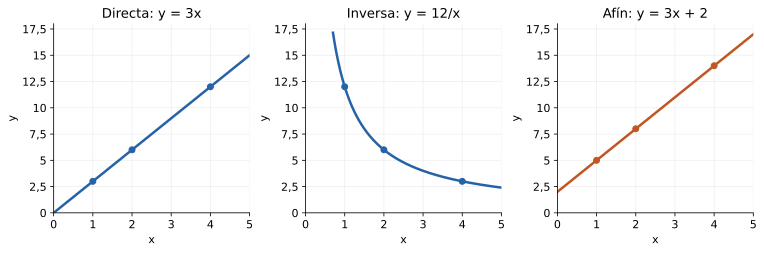

## Propósito y alcance

El razonamiento proporcional compara cantidades multiplicativamente. Se distinguen razón, tasa y proporción, y se establecen criterios para reconocer modelos directos e inversos. La selección del modelo precede al cálculo: una regla de tres solo tiene sentido cuando la relación y sus supuestos han sido justificados.

## Razón, tasa y proporción

:::: {.knowledge-object #tag-00FV tag="00FV" type="definicion" title="Razón y referentes de comparación" requiere="00EJ,00CH"}
::: {#def-00FV .theorem-style-definition data-environment-tag="00FV"}
## Razón y referentes de comparación

Una **razón** es una comparación multiplicativa de dos cantidades mediante un cociente. Se expresa $a:b$ o $a/b$, con $b\ne0$. El orden importa: $a$ es el antecedente y $b$ el consecuente. Para cantidades de la misma magnitud, se expresan primero en unidades compatibles.
:::

Una razón parte-parte y una razón parte-total no son intercambiables. La escritura fraccionaria puede representar un número sin unidad o una comparación contextual; hay que declarar qué significa cada término. Una razón no exige que el antecedente sea menor que el consecuente.

::: {#exm-00FV .theorem-style-remark data-environment-tag="00FW"}
## Razón y referentes de comparación

En una mezcla hay $2$ vasos de concentrado y $5$ de agua. La razón concentrado:agua es $2:5$, mientras que concentrado:mezcla es $2:7$.
:::
::::

:::: {.knowledge-object #tag-00FX tag="00FX" type="definicion" title="Tasa y valor por unidad" requiere="00FV,00CT"}
::: {#def-00FX .theorem-style-definition data-environment-tag="00FX"}
## Tasa y valor por unidad

Una **tasa** es una razón entre cantidades de magnitudes distintas, por lo que conserva una unidad compuesta, como pesos por kilogramo o kilómetros por hora. Una **tasa unitaria** expresa el valor correspondiente a una unidad del denominador.
:::

La tasa media resume totales de un intervalo o conjunto; no afirma que la relación sea constante en cada instante. Igualar unidades permite comparar ofertas, pero pueden importar otras condiciones, como costos fijos o restricciones de cantidad.

::: {#exm-00FX .theorem-style-remark data-environment-tag="00FY"}
## Tasa y valor por unidad

Si $3\,\mathrm{kg}$ cuestan $\$7\,500$, el costo medio es $\$2\,500/\mathrm{kg}$. Que esta compra tenga esa tasa no basta para afirmar que cualquier cantidad mantenga el mismo precio por kilogramo.
:::
::::

:::: {.knowledge-object #tag-00FZ tag="00FZ" type="definicion" title="Proporción e igualdad de razones" requiere="00FV,00EN"}
::: {#def-00FZ .theorem-style-definition data-environment-tag="00FZ"}
## Proporción e igualdad de razones

Una **proporción** es una igualdad de razones:
$$\frac ab=\frac cd,$$
con $b,d\ne0$. Equivale a $ad=bc$.
:::

Una proporción compara razones; no es sinónimo de cualquier relación entre cantidades. Multiplicar ambos términos de una razón por un mismo factor no nulo conserva su valor. Los productos cruzados resuelven una igualdad ya justificada, pero no establecen por sí solos el modelo.

::: {#exm-00FZ .theorem-style-remark data-environment-tag="00G0"}
## Proporción e igualdad de razones

$2/5=6/15$: triplicar concentrado y agua conserva la mezcla. En cambio, añadir tres vasos a cada componente produce $5/8$, una razón diferente.
:::
::::

## Proporcionalidad directa

:::: {.knowledge-object #tag-00G1 tag="00G1" type="definicion" title="Relación directamente proporcional" requiere="00FX,00FZ"}
::: {#def-00G1 .theorem-style-definition data-environment-tag="00G1"}
## Relación directamente proporcional

Dos variables $x,y$ son **directamente proporcionales** si existe una constante $k$ tal que $y=kx$ para todos los valores admisibles del modelo. Para $x\ne0$, el cociente $y/x=k$ es constante. En modelos de cantidades positivas se toma $k>0$.
:::

La unidad de $k$ es la unidad de $y$ dividida por la de $x$. Duplicar $x$ duplica $y$; sumar entradas suma las salidas correspondientes cuando los valores son admisibles. Si cero pertenece al dominio, corresponde a cero. El dominio de un problema puede ser discreto y no contener todos los reales.

::: {#exm-00G1 .theorem-style-remark data-environment-tag="00G2"}
## Relación directamente proporcional

A precio fijo de $\$800$ por cuaderno, sin cargo adicional, $y=800x$. Para $x=3$, $y=\$2\,400$; para $x=6$, $y=\$4\,800$.
:::
::::

:::: {.knowledge-object #tag-00G3 tag="00G3" type="tecnica" title="Tablas y gráficos de proporcionalidad directa" requiere="00G1"}
::: {#concept-00G3 .editorial-text}
## Tablas y gráficos de proporcionalidad directa

Para contrastar un modelo directo se comprueba que los cocientes $y/x$ sean iguales para las entradas no nulas. Su representación gráfica está contenida en una recta que pasa por el origen; si el dominio es discreto, se representan solo los puntos admisibles.
:::

Que dos cantidades aumenten simultáneamente no basta. En una tabla finita, los datos pueden ser compatibles con proporcionalidad sin demostrar que la relación se extienda a todos los valores. Es necesario considerar el mecanismo o los supuestos del modelo.

::: {#exm-00G3 .theorem-style-remark data-environment-tag="00G4"}
## Tablas y gráficos de proporcionalidad directa

La tabla de pares $(1,800)$, $(2,1\,600)$ y $(5,4\,000)$ conserva $y/x=800$. Los pares $(1,800)$ y $(2,1\,600)$ no determinan, por sí solos, los precios de todas las compras.
:::
::::

## Proporcionalidad inversa

:::: {.knowledge-object #tag-00G5 tag="00G5" type="definicion" title="Relación inversamente proporcional" requiere="00FX,00FZ"}
::: {#def-00G5 .theorem-style-definition data-environment-tag="00G5"}
## Relación inversamente proporcional

Dos variables no nulas $x,y$ son **inversamente proporcionales** si existe una constante no nula $k$ tal que
$$y=\frac{k}{x},\qquad xy=k.$$
En modelos de cantidades positivas, $x,y,k>0$.
:::

Duplicar una variable reduce la otra a la mitad. La constante tiene unidad producto, no cociente. Que una variable aumente y otra disminuya no basta para identificar proporcionalidad inversa.

::: {#exm-00G5 .theorem-style-remark data-environment-tag="00G6"}
## Relación inversamente proporcional

Para recorrer $120\,\mathrm{km}$ a rapidez constante $v$, el tiempo es $t=120/v$. A $40\,\mathrm{km/h}$ toma $3\,\mathrm{h}$; a $60\,\mathrm{km/h}$, $2\,\mathrm{h}$. El producto $vt$ vale $120\,\mathrm{km}$.
:::
::::

:::: {.knowledge-object #tag-00G7 tag="00G7" type="tecnica" title="Tablas, gráficos y supuestos de un modelo inverso" requiere="00G5"}
::: {#concept-00G7 .editorial-text}
## Tablas, gráficos y supuestos de un modelo inverso

Un modelo inverso se contrasta mediante productos constantes. Para variables positivas, su gráfica es una rama de hipérbola en el primer cuadrante; no corta los ejes. Al cambiar una variable por un factor $r>0$, la otra cambia por el factor $1/r$.
:::

En tareas de trabajo y tiempo se requieren supuestos: igual productividad, trabajo divisible y ausencia de interferencia. No toda tarea se acelera en proporción al número de personas. Si hay tiempo fijo de preparación, la relación total deja de ser inversamente proporcional.

::: {#exm-00G7 .theorem-style-remark data-environment-tag="00G8"}
## Tablas, gráficos y supuestos de un modelo inverso

Con $24$ horas-persona de trabajo divisible, $2$ personas requieren $12$ horas y $6$ personas, $4$ horas. Si además se requieren $2$ horas fijas de espera, los tiempos totales son $14$ y $6$, y sus productos por el número de personas ya no coinciden.
:::
::::

## Regla de tres, escalas y problemas

:::: {.knowledge-object #tag-00G9 tag="00G9" type="tecnica" title="Regla de tres y paso por la unidad" requiere="00G1,00G5"}
::: {#concept-00G9 .editorial-text}
## Regla de tres y paso por la unidad

Para pares positivos $(x_1,y_1)$ y una entrada $x_2$:

(a) Si el modelo es directo, $y_2=y_1(x_2/x_1)$.
(b) Si el modelo es inverso, $y_2=y_1(x_1/x_2)$.

Antes de calcular se determina qué cociente o producto se mantiene constante.
:::

El paso por la unidad reconstruye la constante y ofrece una alternativa comprensible a una plantilla. El resultado se controla anticipando si debe aumentar o disminuir. En modelos con varias variables se identifican cuáles permanecen fijas.

::: {#exm-00G9 .theorem-style-remark data-environment-tag="00GA"}
## Regla de tres y paso por la unidad

Si $4$ metros de tela cuestan $\$10\,000$ a precio constante por metro, un metro cuesta $\$2\,500$ y $7$ metros cuestan $\$17\,500$. Con una tarifa fija adicional, esa regla no sería válida para el total.
:::
::::

:::: {.knowledge-object #tag-00GB tag="00GB" type="definicion" title="Escalas y semejanza" requiere="00G1,00CR"}
::: {#def-00GB .theorem-style-definition data-environment-tag="00GB"}
## Escalas y semejanza

Una **escala lineal** compara una longitud de representación con su correspondiente longitud real, expresadas en la misma unidad. Una escala $1:n$, con $n>0$, significa que una unidad de longitud en la representación corresponde a $n$ unidades reales.
:::

Una escala conserva razones de longitudes. En figuras semejantes con factor lineal $k>0$, las áreas cambian por $k^2$ y los volúmenes por $k^3$. No se aplica el factor lineal directamente a áreas o volúmenes.

::: {#exm-00GB .theorem-style-remark data-environment-tag="00GC"}
## Escalas y semejanza

A escala $1:25\,000$, $4\,\mathrm{cm}$ en el mapa representan $100\,000\,\mathrm{cm}=1\,\mathrm{km}$. Si una figura se amplía al doble, su área se cuadruplica.
:::
::::

:::: {.knowledge-object #tag-00GD tag="00GD" type="tecnica" title="Tasa media y composición de razones" requiere="00FX"}
::: {#concept-00GD .editorial-text}
## Tasa media y composición de razones

La tasa media de un conjunto de tramos se obtiene dividiendo el total de la magnitud del numerador por el total de la magnitud del denominador. Componer tasas exige mantener unidades compatibles y controlar qué cantidades se cancelan.
:::

El promedio aritmético de tasas solo coincide con la tasa global bajo condiciones específicas. Por ejemplo, el promedio de rapideces es adecuado para tiempos iguales, no para distancias iguales. Las tablas con unidades permiten reconstruir el cálculo.

::: {#exm-00GD .theorem-style-remark data-environment-tag="00GE"}
## Tasa media y composición de razones

Un recorrido de $60\,\mathrm{km}$ a $30\,\mathrm{km/h}$ toma $2\,\mathrm{h}$ y otros $60\,\mathrm{km}$ a $60\,\mathrm{km/h}$ toman $1\,\mathrm{h}$. La rapidez media es $120/3=40\,\mathrm{km/h}$, no $45\,\mathrm{km/h}$.
:::
::::

## Situaciones no proporcionales y errores frecuentes

:::: {.knowledge-object #tag-00GF tag="00GF" type="observacion" title="Relaciones afines y otros contraejemplos" requiere="00G3,00G7"}
::: {#concept-00GF .editorial-text}
## Relaciones afines y otros contraejemplos

Una relación $y=kx+b$ con $b\ne0$ no es directamente proporcional, aunque su gráfica sea una recta. Un modelo $y=kx^2$ con $k\ne0$ tampoco lo es. Una dependencia decreciente, como $y=10-x$, no es en general inversamente proporcional.
:::

El razonamiento aditivo y el multiplicativo responden a estructuras distintas. Detectar un cargo fijo, un área o una restricción permite evitar una regla de tres injustificada. Los datos deben leerse junto con el contexto y el dominio.

::: {#exm-00GF .theorem-style-remark data-environment-tag="00GG"}
## Relaciones afines y otros contraejemplos

Una tarifa hipotética $y=1\,000+500x$ cuesta $\$2\,000$ para $x=2$ y $\$3\,000$ para $x=4$: duplicar $x$ no duplica el precio. Para cuadrados, pasar de lado 2 a lado 4 lleva el área de 4 a 16.
:::
::::

## Síntesis para la consulta docente

{fig-alt="Tres gráficos: la recta y igual a tres x pasa por el origen; la hipérbola y igual a doce dividido por x decrece en el dominio positivo; la recta y igual a tres x más dos corta el eje vertical en dos."}

| Modelo | Invariante | Cambio al multiplicar $x$ por $r>0$ | Gráfico |
|---|---|---|---|
| Directo: $y=kx$ | $y/x$ | $y$ se multiplica por $r$ | Recta por el origen |
| Inverso: $y=k/x$ | $xy$ | $y$ se divide por $r$ | Hipérbola |
| Afín: $y=kx+b$, $b\ne0$ | Diferencias para incrementos iguales | No hay factor constante general | Recta con intercepto no nulo |

Conviene pedir al estudiante que identifique las cantidades, escriba las unidades, anticipe el cambio y justifique el invariante. Un cálculo correcto mediante productos cruzados no demuestra por sí solo comprensión del modelo.

## Conexiones y procedencia

Desarrolla el capítulo 31 de la [tabla maestra](../../../docs/tabla-contenidos-maestra.md), «Razones y proporcionalidad». Se conecta con [Racionales](numeros-racionales.qmd), [Magnitudes y unidades](magnitudes-medicion-unidades.qmd), [Porcentajes](porcentajes.qmd) y [Funciones](../algebra/funciones.qmd). Redacción y ejemplos originales; [Fuentes consultadas](../../../docs/referencias-numeros-medicion.md).
